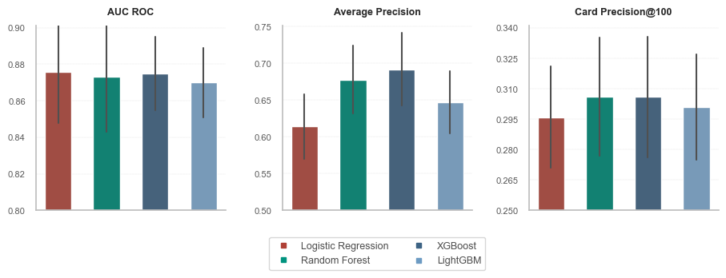
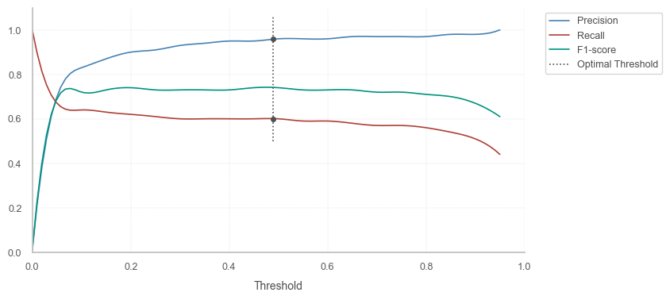
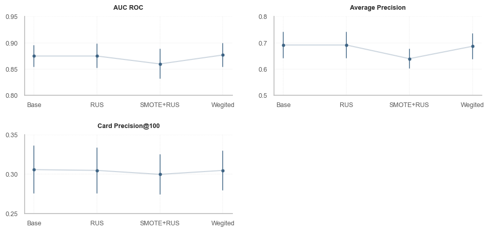

## Обнаружение мошеннических операций с кредитными картами

   

#### Содержание
1. Описание проекта
2. Описание датасета
3. Создание дополнительных предикторов (feature engineering)
4. Используемые ML-алгоритмы
5. Особенности работы с последовательностью транзакций
6. Метрики для оценки эффективности моделей
7. Результаты базовых моделей
8. Метрики, ориентированные на транзакции  
    8.1. AUC ROC  
    8.2. Precision-Recall  
    8.3. Precision-Recall Trade-off 
9. Метрики, ориентированные на банковские карты  
    9.1. Card Precision top-k
10. Техники для преобразования несбалансированных датасетов
11. Время работы алгоритмов
12. Дополнительно. Результаты валидации и тестирования моделей

### 1. Описание проекта

В проекте оценивается эффективность работы алгоритмов машинного обучения, предназначенных для выявления и прогнозирования мошенничества с банковскими картами. 

Модели строятся с учетом особенностей работы с банковскими транзакциями и временными рядами:
- вводится ***задержка*** между периодами обучения, валидации и оценки моделей;
- используется предварительная валидация (***prequential validation***) со скользящим окном.

Для повышения эффективности прогнозирования рассчитываются дополнительные предикторы, учитывающие время суток, рабочие/нерабочие дни, сегментацию клиентов согласно ***RFM (Recency, Frequency, Monetary)***.

Эффективность оценивается с точки зрения способности моделей выявлять как ***подозрительные транзакции***, так и ***банковские карты***, используемые мошенниками. 

Для оценки используются метрики AUC ROC, Average Precision, ***Card Precision***, строятся кривые ROC и Precision-Recall, оценивается влияние величины порогового коэффициента на прогнозы, выдаваемые ML-алгоритмами.

Дополнительно оценивается целесообразность применения техник для преобразования несаблансированных датасетов:
- удаление мажоритарных классов (undersampling);
- комбинированный подход (undersampling + oversampling);
- использование весов классов (weighted models).

### 2. Описание датасета

Данные сгенерированы по методике, описанной в совместной работе исследователей из университетов Брюсселя и Люксембурга, а также команды машинного обучения компании Worldline Labs. Датасет состоит из последовательности банковских транзакций:

- Всего транзакций: 2 107 260;
- Мошеннических транзакций: 17 752 (0.84%);
- Число характеристик транзакций: 9.

   

- **'transaction_id'**: идентификатор транзакции;
- **'tx_datetime'**: дата и время совершения транзакции;
- **'customer_id'**: идентификатор карты;
- **'terminal_id'**: идентификатор терминала;
- **'tx_amount'**: сумма транзакции;
- **'tx_time_seconds'**: время в секундах, начиная с 0:00 часов суток совершения первой транзакции;
- **'tx_time_days'**: число дней с момента первой транзакции;
- **'tx_fraud'**: метка мошенничества (1 - мошенническая транзакция, 0 - подлинная транзакция);
- **'tx_fraud_scenario'**: тип мошенничества (для построения моделей мультиклассовой классификации).

### 3. Создание дополнительных предикторов (Feature Engineering)

Дополнительно сгенерированы признаки, учитывающие:
- время совершения транзакции (день/ночь);
- день совершения транзакции (рабочий/нерабочий);
- скользящее среднее числа транзакций по каждой карте (размер окна: 1,7,30 дней);
- скользящее среднее суммы транзакций по каждой карте (размер окна: 1,7,30 дней);
- скользящее среднее числа транзакций по каждому терминалу (размер окна: 1,7,30 дней);
- скользящее среднее числа мошеннических операций по каждому терминалу (размер окна: 1,7,30 дней).

Итоговый датасет содержит 15 предикторов и 1 целевую переменную - метку мошенничества.

### 4. Используемые ML-алгоритмы

- *Logistic Regression* (*linear*): самый простой и легко интерпретируемый алгоритм;
- *Random Forest* (*bagging*): сложнее для интерпретации, чем регрессия, но прогнозы точнее;
- *XGBoost* (*boosting*): самый эффективный с точки зрения прогнозов, но сложен для интерпретации и в подборе гиперпараметров;
- *LightGBM* (*boosting*): работает быстрее, чем XGBoost, но эффективность ниже.

### 5. Особенности работы с последовательностью транзакций

Время, необходимое для проверки подозрительных транзакций, учитывается в виде дополнительного параметра модели (***задержка***). Задержка принимается равной одной неделе.

Банковские карты, определенные в период обучения и период задержки как мошеннические, ***удаляются*** из тестового датасета.

Для валидации моделей используется предварительная валидация (***prequential validation***) со скользящим окном. Периоды обучающего, валидационного и тестового набора данных, а также задержки, одинаковы и принимаются равными одной неделе.

### 6. Метрики для оценки эффективности моделей

- ***AUC ROC*** (площадь под кривой ROC) - классическая метрика оценки эффективности работы алгоритмов машинного обучения.  
  Хорошо изучена и часто применяется в разных сегментах противодействия мошенничеству.
- ***Card Precision Top-k*** - не так широко представлена, как AUC ROC, но обладает большим потенциалом.  
  Учитывает специфику работы с транзакциями в системе выявления и верификации мошеннических операций финансовых организаций.
- ***Average Precision*** (площадь под кривой Precision-Recall) - так же хорошо известная метрика.  
  Здесь используется как бенчмарк для выбора оптимальной модели - компромисс между AUC ROC и Card Precision.

### 7. Результаты базовых моделей

Модели и гиперпараметры, наиболее эффективные с точки зрения Average Precision:

- Logictic Regression (penalty=l2, C=1, solver='saga', max_iter=5000);
- Random Forest (n_estimators=150, max_depth=25);
- XGBoost (n_estimators=150, max_depth=3, learning_rate=0.1);
- LightGBM (n_estimators=150, max_depth=3, learning_rate=0.1).

Примечание: *в работе не проводились симуляции с применением ресэмплинга. Оценки и доверительные интервалы рассчитаны по итогам предварительной валидации, состоящей из 4 train-valid-test блоков данных (folds). Этого недостаточно для выводов о статистической значимости. Однако можно сделать предположение, что полученные результаты не изменятся с увеличением числа симуляций - доверительные интервалы будут сужаться без заметного изменения относительной эффективности моделей.*

Логистическая регрессия эффективно сработала с точки зрения AUC ROC, но уступает ансамблевым алгоритмам по другим метрикам. По совокупности XGBoost выглядит наиболее предпочтительным. 

В пункте 8 описаны метрики, оценивающие модель в контексте количества выявленных мошеннических ***транзакций***. В пункте 9 исследуется метрика, ориентированная на охват как можно бóльшего числа ***банковских карт***, используемых мошенниками.

### 8. Метрики, ориентированные на транзакции

В пунктах 8.1. и 8.2. оценим модели в терминах машинного обучения. Далее в пункте 8.3. посмотрим, как эти метрики связаны с эффективностью обнаружения мошеннических операций. 

#### 8.1. AUC ROC

Построим ROC-кривую для оценки эффективности алгоритмов (используются суточные данные).

Logistic Regression и Random Forest работают чуть лучше. Если оценивать исключительно по AUC ROC, то эти алгоритмы - предпочтительный выбор. Начиная со значения False Positive Rate, равного примерно 0.3, заметен провал XGBoost по эффективности.

Площадь под кривой ROC (AUC) - одна из наиболее популярных метрик для оценки моделей машинного обучения. В то же время она плохо подходит для оценки моделей, созданных для выявления мошеннических операций с банковскими картами.

Дело в том, что по определению метрика AUC ROC агрегирует производительность модели для всей площади под кривой ROC. Но модели по выявлению мошенничества обычно работают в диапазоне False Positive Rate не выше 0.001. При бóльшем уровне False Positive Rate, модель будет фиксировать ложные мошенничества настолько часто, что для их ручной проверки потребуется слишком много времени. Таким образом, актуальной является крайне небольшая часть графика для значения False Positive Rate меньше 0.001.

Более гибкой и полезной метрикой в этом смысле является Precision-Recall.

#### 8.2. Precision-Recall

Построим кривую Precision-Recall. Оптимальные соотношения Precision и Recall здесь рассчитаны через среднее гармоническое (F1-мера).

Logistic Regression и LightGBM работают чуть хуже. Random Forest и XGBoost показывают одинаковые результаты в оптимальной точке. Кривая XGBoost выглядит интереснее, покрывает бóльшую площадь, а значит более эффективна и лучше настраивается с помощью подбора порогового значения. 

На примере XGBoost изучим воздействие значения порогового коэффициента на число выявляемых мошеннических транзакций.

#### 8.3 Precision-Recall Trade-off

Модель можно подстраивать с помощью изменения величины порогового коэффициента (**threshold**).  
Отобразим результаты алгоритма XGBoost в виде матрицы ошибок.

Всего алгоритм оценил 57 443 транзакции (общее число мошенничеств - 381 (0.66%)).  

Правильно классифицированы:
- 57 053 транзакции как легальные;
- 227 транзакции как мошеннические.

Допущенные ошибки:
- 9 легальных транзакций классифицировано как мошеннические;
- 154 мошенническим транзакциям присвоен статус легальных.

Алгоритм ***очень точно*** классифицирует транзакции. Если транзакции присвоена метка "мошенничество", то в 96% ручная обработка транзакции это подтверждает.

Соотношение точности (***Precision***, 96%) и охвата (***Recall***, 60%) можно варьировать, изменяя пороговое значение оценок алгоритма. Увеличение охвата модели (то есть способность замечать больше мошеннических транзакций) приводит к уменьшению точности.

Чтобы настроить модель под бизнес-задачи, необходимо оценить:
- финасовые потери в среднем от одной упущенной (незамеченной) транзакции;
- затраты на проверку одной подозрительной транзакции.

График показывает изменение точности (Precision) и охвата (Recall) в зависимости от величины порогового коэффициента. Кривая F1-score - это агрегированный показатель, оценивающий совокупную эффективность.

Показатели практически неизменны на всём диапазоне пороговых значений выше 0.15.

Преобразуем эти метрики для улучшения интерпретации - построим график зависимости ***упущенных мошенничеств*** от числа ***ошибочно предсказанных*** мошенничеств.

Здесь проявляется общая логика работы с пороговым коэффициентом - снижение числа упущенных мошенничеств приводит к увеличению количества ошибок в прогнозах (ложно-положительные предсказания). Маневр для подстройки модели имеется в диапазоне от 0 до 150 по оси X (выделено пунктирной линией). В остальных частях графика взаимосвязь практически отсутствует. 

Увеличим область, отмеченную пунктиром.

В интервале, отмеченном светло-серой областью, соотношение **1 к 2**:
- уменьшение количества пропущенных мошенничеств на 1 транзакцию (ось Y)
- приведет к увеличению ложных срабатываний на 2 транзакции (ось X)

В интервале, отмеченном темно-серой областью, соотношение **1 к 4**:
- уменьшение количества пропущенных мошенничеств на 1 транзакцию (ось Y)
- приведет к увеличению ложных срабатываний на 4 транзакции (ось X)

####  **Вывод** 

- Невозможно одновременно увеличивать точность и степень охвата алгоритма.
- Компромисс между точностью и охватом - это компромисс между **ценой** упущенной мошеннической транзакции и **издержками** на проверку подозрительных транзакций.

В зависимости от величины соответствующих затрат, выбирается оптимальное значение порогового коэффициента. 

### 9. Метрики, ориентированные на банковские карты

#### 9.1. Card Precision top-k

Card Precision - это метрика, которая учитывает оперативные возможности банковских сотрудников, проверяющих подозрительные транзакции. Она показывает долю реальных мошеннических карт из *k* наиболее подозрительных с точки зрения модели. Параметр *k* обычно принимается равным количеству карт, которое специалисты способны проверить вручную за сутки.

Модель, выбранная с помощью данной метрики, фиксирует больше разнородных транзакций. Подобная вариативность приводит к бóльшему охвату по картам. Теоретически, охват бóльшего числа карт мошенников позволяет предотвратить бóльшие потери в будущем.

Помимо этого, метрика Card Precision top-k интуитивно более понятна специалистам, которые осуществляют проверку подозрительных транзакций.

**Пример на суточных данных**

Всего транзакций: 8267.  
Из них мошеннических: 54 (0.65%).  

Всего карт: 3203 (в среднем 2.5 транзакции на карту).  
Из них мошеннических: 51 (1.6%).

Параметр *k* принимается равным 100.

Показатели алгоритма XGBoost:

- Выявлено 30 мошеннических карт (59% от общего числа мошеннических карт);
- 65 карт правильно классифицированы как легальные;
- Не замечена 21 мошенническая карта (41% от общего числа мошеннических карт); 
- В топ-100 подозрительных попали 5, которые при этом не были классифицированы как мошеннические.

Точность алгоритма - 100%. Все карты, которым модель присвоила метку "мошенничество", действительно оказались мошенническими. Это полезная информация для сотрудников, отвечающих за проверку подозрительных транзакций. Карты и транзакции, отмеченные моделью как мошеннические, должны проверяться в первую очередь.

Метрика CardPrecision@100 равна 30 / 100 = 0.300. Максимальное значение метрики в данном случае - это число истинно мошеннических карт, деленное на *k*: 51 / 100 = 0.510. Идеальная модель поместила бы 51 карту в топ-100 наиболее подозрительных.

**Алгоритм расчета Card Precision top-k**

Для расчета метрики используется значение вероятности мошенничества *p*, которое модель присваивает каждой транзакции.

- для каждой карты определяются все транзакции, совершенные по ней за сутки;
- среди них самая высокая вероятность мошенничества *p* (наиболее подозрительная транзакция) становится ***коэффициентом*** этой карты;
- карты сортируются по убыванию величины коэффициента;
- выбираются топ *k* карт с наиболее высоким значением коэффициента;
- считается доля правильно классифицированных мошеннических карт из числа топ *k*;

####  **Вывод** 

Card Precision - эффективная метрика, которая при этом адаптирована под выявление и предупреждение мошеннических операций с кредитными картами (в отличие от классических ML-метрик).

### 10. Техники для преобразования несбалансированных датасетов

Рассмотрены:

- удаление мажоритарных классов (undersampling)
- комбинированный подход (undersampling + oversampling)
- использование весов классов (weighted models).

**AUC ROC**

AUC ROC каждой из исследуемых моделей можно улучшить с помощью техник балансировки.  

Для Logistic Regression и Random Forest наиболее эффективен комбинированный подход. XGBoost немного улучшается после присваивания веса каждому классу. LightGBM лучше работает после удаления мажоритарных классов, но тем не менее не достигает лучших показателей остальных моделей.

**Average Precision**

Average Precision демонстрирует обратную ситуацию. Улучшились результаты только LightGBM (снова с помощью undersampling), но недостаточно, чтобы конкурировать с XGBoost и Random Forest. Logistic Regression стабильно менее эффективна, чем остальные алгоритмы.  

**Card Precision**

Для Card Precision наблюдается похожая картина. Заметное ухудшение производительности всех моделей при комбинированном подходе. Базовый XGBoost остается самым эффективным алгоритмом.  

####  **Вывод** 

Можно сказать, что в целом техники работы с несбалансированными датасетами не дают заметного прироста в результатах, а в контексте Average Precision и Card Precision могут заметно уменьшить эффективность лучших моделей. Как было отмечено выше, числа симуляций (N: 4) недостаточно для однозначного вывода.

Дисперсия на примере результатов XGBoost.

### 11. Время работы алгоритмов

При работе с банковскими транзакциями скорость выполнения операций является одним из ключевых факторов. 

Можно отметить, что несмотря на невысокую скорость подбора гиперпараметров и обучения, XGBoost очень быстро генерирует прогнозы и уступает по этому показателю только самому "легкому" алгоритму - Logistic Regression. 

LightGBM и Logistic Regression - явно лидируют по скорости обучения и поиска гиперпараметров. 

### 12. Дополнительно. Результаты валидации и тестирования моделей

Модели оцениваются по трем метрикам: AUC ROC, Average Precision, CardPrecision@100.  
Оптимальной считается модель с наивысшем значением Average Precision на валидационном датасете.

#### Logistic Rgression

   
   

#### Random Forest

   
   

#### XGBoost

   
   

#### LightGBM

   
   