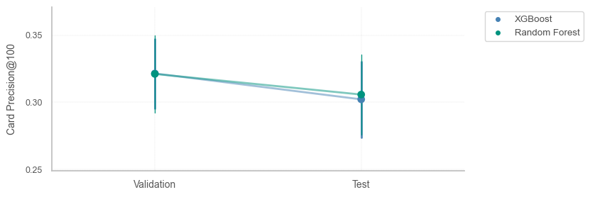
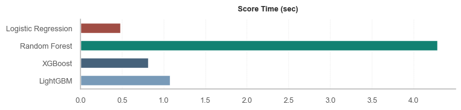
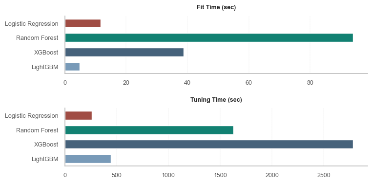

## Обнаружение мошеннических операций с кредитными картами

   

#### Содержание
1. Описание проекта
2. Описание датасета
3. Создание дополнительных предикторов (feature engineering)
4. Используемые ML-алгоритмы
5. Особенности работы с последовательностью транзакций
6. Метрики для оценки эффективности моделей
7. Результаты базовых моделей
8. Метрики, ориентированные на транзакции 
    8.1. AUC ROC  
    8.2. Precision-Recall  
    8.3. Precision-Recall Trade-off 
9. Метрики, ориентированные на банковские карты
    9.1. Card Precision top-k
10. Техники для преобразования несбалансированных датасетов
11. Время работы алгоритмов
12. Дополнительно. Результаты валидации и тестирования моделей

### 1. Описание проекта

В проекте оценивается эффективность работы алгоритмов машинного обучения, предназначенных для выявления и прогнозирования мошенничества с банковскими картами. 

Модели создаются с учетом особенностей работы с банковскими транзакциями и временными рядами:
- вводится **задержка** между периодами обучения, валидации и оценки моделей;
- используется предварительная валидация (**prequential validation**) со скользящим окном.

Для повышения эффективности прогнозирования рассчитываются дополнительные предикторы, учитывающие время суток, рабочие/нерабочие дни, сегментацию согласно **RFM (Recency, Frequency, Monetary)**.

Для оценки моделей используются метрики AUC ROC, Average Precision, **Card Precision**, строятся кривые ROC и Precision-Recall, оценивается влияние величины порогового коэффициента на эффективность ML-алгоритмов.

После оценки эффективности алгоритмов в терминах машинного обучения, рассматривается их способность выявлять как **подозрительные транзакции**, так и **банковские карты**, используемые для совершения мощеннических операций. 

Дополнительно оценивается целесообразность применения техник для преобразования несаблансированных датасетов:
- удаление мажоритарных классов (undersampling);
- комбинированный подход (undersampling + oversampling);
- использование весов классов (weighted models).

### 2. Описание датасета

Данные сгенерированы по методике, описанной в совместной работе исследователей из университетов Брюсселя и Люксембурга, а также команды машинного обучения компании Worldline Labs. 

Датасет состоит из последовательности банковских транзакций:

- Всего транзакций - 2 107 260;
- Мошеннических транзакций - 17 752 (0.84%);
- Число характеристик транзакций - 9.

   

- **'transaction_id'**: идентификатор транзакции;
- **'tx_datetime'**: дата и время совершения транзакции;
- **'customer_id'**: идентификатор карты;
- **'terminal_id'**: идентификатор терминала;
- **'tx_amount'**: сумма транзакции;
- **'tx_time_seconds'**: время в секундах, начиная с 0:00 часов суток совершения первой транзакции;
- **'tx_time_days'**: число дней с момента первой транзакции;
- **'tx_fraud'**: метка мошенничества (1 - мошенническая транзакция, 0 - подлинная транзакция);
- **'tx_fraud_scenario'**: тип мошенничества (для построения моделей мультиклассовой классификации).

### 3. Создание дополнительных предикторов (Feature Engineering)

Дополнительно сгенерированы признаки, учитывающие:
- время совершения транзакции (день/ночь);
- день совершения транзации (рабочий/нерабочий);
- скользящее среднее числа транзакций по каждой карте (размер окна: 1,7,30 дней);
- скользящее среднее суммы транзакций по каждой карте (размер окна: 1,7,30 дней);
- скользящее среднее числа транзакций по каждому треминалу (размер окна: 1,7,30 дней);
- скользящее среднее числа мошеннических операций по каждому треминалу (размер окна: 1,7,30 дней).

Итоговый датасет содержит 15 предикторов и 1 целевую переменную - метку мошенничества.

### 4. Используемые ML-алгоритмы

- *Logistic Regression* (*linear*): самый простой и легко интерпретируемый алгоритм;
- *Random Forest* (*bagging*): сложнее для интерпретации, чем регрессия, но прогнозы точнее;
- *XGBoost* (*boosting*): самый эффективный с точки зрения прогнозов, но сложен в интерпретации и подборе гиперпараметров;
- *LightGBM* (*boosting*): работает быстрее, чем XGBoost, но эффективность ниже.

### 5. Особенности работы с последовательностью транзакций

Время, необходимое для проверки подозрительных транзакций, учитывается в виде дополнительного параметра модели (***задержка***). Задержка принимается равной одной неделе.

Банковские карты, определенные в период обучения и период задержки как мошеннические, ***удаляются*** из тестового датасета.

Для валидации моделей используется предварительная валидация (***prequential validation***) со скользяшим окном.  
Периоды обучающего, валидационного и тестового набора данных, а также задержки, одинаковы и равны одной неделе.

### 6. Метрики для оценки эффективности моделей

- ***AUC ROC*** (площадь под кривой ROC) - классическая метрика оценки эффекивности работы алгоритмов машинного обучения.  
  Хорошо изучена и часто применяется в разных сегментах противодействия мошенничеству.
- ***Card Precision Top-K*** - не так широко представлена, как AUC ROC, но обладает большим потенциалом.  
  Учитывает специфику работы с транзакциями в системе выявления и верификации мошеннических операций финансовых организаций.
- ***Average Precision*** (площадь под кривой Precision-Recall) - так же хорошо известная метрика.  
  Здесь используется как бенчмарк дял выбора оптимальной модели - компромисс между AUC ROC и Card Precision.

### 7. Результаты базовых моделей

Модели и гиперпараметры, наиболее эффективные с точки зрения Average Precision:

- Logictic Regression (penalty=l2, C=1, solver='saga', max_iter=5000);
- Random Forest (n_estimators=150, max_depth=25);
- XGBoost (n_estimators=150, max_depth=3, learning_rate=0.1);
- LightGBM (n_estimators=150, max_depth=3, learning_rate=0.1).

Примечание: *в работе не проводились симуляции с применением ресэмплинга. Оценки и доверительные интервалы рассчитаны по итогам предварительной валидации, состоящей из 4 train-valid-test блоков данных (folds). Этого недостаточно для однозначных выводов о статистической значимости результатов, но тем не менеее предоставляет интересную информацию. Можно предположить, что с увеличением числа экспериментов, доверительные интервалы будут сужаться без заметного изменения средней эффективности моделей.*

Логистическая регрессия эффективно сработала с точки зрения AUC ROC, но уступает ансамблевым алгоритмам по другим метрикам.

Далее в Разделе 8 рассматриваются метрики, оценивающие модель в контексте выявленных мошеннических **транзакций**.  
В разделе 9 исследуется метрика, ориентрованная на выявление **банковских карт**, используемых мошенниками.

### 8. Метрики, ориентированные на транзакции

В пунктах 8.1. и 8.2. оценим модели в терминах машинного обучения.  
После этого в пункте 8.3. посмотрим, как это связано с эффективностью обнаружения мошеннических операций.

Примечание: *для построения кривых и демонстрации влияния величины порогового коэффициента была проведена дополнительная симуляция на период величиной в одну неделю*.

#### 8.1. AUC ROC

Построим ROC-кривую для оценки эффективности алгоритмов.

ROC-кривая практически не предоставляет полезной информации.  
Точки оптимальных значений рассчитаны через среднее гармоническое Precision и Recall (F1-мера). Они располагаются очень близко к оси Y - это следствие несбалансированности датасета (доля мошеннических транзакций - 0.84%).

Здесь Logistic Regression и Random Forest работают чуть лучше.  
Если оценивать испключительно по AUC ROC, то эти алгоритмы - предпочтительный выбор.

Начиная со значения False Positive Rate, равного примерно 0.3, заметен провал XGBoost по эффективности.

Взглянем кривую Precision-Recall.

#### 8.2. Precision-Recall

Logistic Regression и LightGBM работают чуть хуже.

Random Forest и XGBoost показывают одинаковые результаты в оптимальной точке.  
Кривая XGBoost выглядит интереснее, покрывает бóльшую площадь, а значит более эффективна и лучше настраивается с помощью подбора порогового значения. 

На примере XGBoost изучим воздействие значения порогового коэффициента на число выявляемых мошеннических транзакций.

#### 8.3 Precision-Recall Trade-off

Модель можно подстраивать с помощью изменения величины порогового коэффициента (**threshold**).

Отобразим результаты алгоритма XGBoost в виде матрицы ошибок.

Всего алгоритм оценил 57 443 транзакции (общее число мошенничеств - 381 (0.66%)).  

Правильно классифицрованы:
- 57 053 транзакции как легальные;
- 227 транзакции как мошеннические.

Допущенные ошибки:
- 9 легальных транзакций классифицировано как мошеннические;
- 154 мошенническим транзакциям присвоен статус легальных.

**Интерпретация результатов**
- Алгоритм **очень точно** классифицирует транзакции.  
  Если транзакции присвоена метка "мошенничество", то в 96% случаев это соответствует действительности.

- Достаточно большое число мошеннических транзакций алгоритм **не замечает**.  
  Выявлено около 60% от общего числа мошеннических транзакций.

Соотношение точности (***Precision***, 96%) и охвата (***Recall***, 60%) можно варьировать, изменяя пороговое значение оценок алгоритма.  
Увеличение охвата модели (то есть способность замечать больше мошеннических тразнакций) приводит к уменьшению точности.

Чтобы настроить модель под бизнес-задачи, необходимо оценить:
- финасовые потери в среднем от одной упущенной (незамеченной) транзакции;
- затраты на проверку одной подозрительной транзакции.

График показывает изменение точности (Precision) и охвата (Recall) в зависимости от величины порогового коэффициента.  
Кривая F1-score - это агрегированный показатель, оценивающий совокупную эффективность.

До порога 0.6 точность более эластична.  
Резкое изменение обоих показателей при величине порога ниже 0.15. 

Преобразуем эти метрики для лучшей интерпретации с точки зрения мошеннический транзакций.  
Построим график зависимости упущенных мошенничеств от числа ошибочно предсказанных мошенничеств.

Здесь проявляется общая логика работы с пороговым коэффициентом - уменьшение числа незамеченных мошенничеств приводит к увеличению количества ошибочно предсказанных мошенничеств (ложно-положительные предсказания).

Видно, что манерв для подстройки модели имеется только в районе от 0 до 150 по оси X (выделено пунктирной линией).  
В остальных частях графика взаимосвязь практически отсутствует. 

Увеличим область, отмеченную пунктиром.

В интервале, отмеченном светло-серой областью, соотношение **1 к 2**:
- уменьшение количества пропущенных мошенничеств на 1 транзакцию (ось Y)
- приведет к увеличению ложных срабатываний на 2 транзакции (ось X)

В интервале, отмеченном темно-серой областью, соотношение **1 к 4**:
- уменьшение количества пропущенных мошенничеств на 1 транзакцию (ось Y)
- приведет к увеличению ложных срабатываний на 4 транзакции (ось X)

####  **Вывод** 

- Невозможно одновременно увеличивать точность и степень охвата алгоритма.
- Компромисс между точностью и охватом - это компромисс между **ценой** упущенной мошеннической транзакции и **издержками** на проверку подозрительных транзакций.

В зависимости от величины соответствующих затрат, выбирается оптимальное значение порогового коэффициента. 

### 9. Метрики, ориентированные на мошеннические карты

#### 9.1. Card Precision top-k

В этом разделе описана метрика, показывающая насколько эффективно модель способна классифицировать карты, используемые мошенниками.

Модель, выбранная с помощью данной мерики, фиксирует больше разнородных транзакций. Подобная вариативность приводит к бóльшему охвату по картам. Теоретически охват бóльшего числа карт мошенников позволяет предотвратить бóльшие потери в будущем.  

Помимо этого, метрика Card Precision top-K интуитивно более понятна специалистам, которые осуществляют проверку подозрительных транзакций.

Для расчета метрики используется значение вероятности мошенничества *p*, которое модель присваивает каждой транзакции.

**Методика расчета**
- для каждой карты определяются все транзакции, совершенные по ней за сутки;
- среди них самая высокая вероятность мошенничества *p* (наиболее подозрительная транзакция) становится ***коэффициентом*** этой карты;
- карты сортируются по убыванию величины коэффициента;
- выбираются топ *k* карт с наиболее высоким значением коэффициента;
- считается доля правильно классифицированных мошеннических карт из числа топ *k*;

Параметр *k* - это количество карт, которое специалисты способны проверить вручную за сутки.

**Пример на данных за одни сутки**

Всего транзакций - 8267.  
Из них мошннических - 54 (0.65%).  

Всего карт - 3203 (в среднем 2.5 транзакции на карту).  
Из них мошеннических - 51 (1.6%).

Параметр *k* принимается равным 100.

**Показатели алгоритма XGBoost**

Выявлено 30 мошеннических карт (59% от общего числа мошеннических карт).  
Не замечена 21 мошенническая карта (41% от общего числа мошеннических карт).  
В топ-100 подозрительных попали 5, которые при этом не были классифицированы как мошеннические.

Метрика CardPrecision@100 равна 30 / 100 = 0.300.  
Максимальное значение метрики в данном случае - это число истинно мошенниеских карт, деленное на *k*: 51 / 100 = 0.510.  
Идеальная модель поместила бы 51 карту в топ-100 наиболее подозрительных.  

Точность алгоритма в данном случае - 100%. Все карты, которым модель присвоила метку "мошенничество", действительно оказались мошенническими. Это полезная информация для сотрудников, отвечающих за проверку подозрительных транзакций. В случае, если модель классифицирует карту как мошенническую, транзакция должна проверяться в приоритетном порядке. 

Но не стоит забывать, что 40% мошеннических карт все же не были выявлены.

**Сравнение с AUC ROC**

Тем не менее, если посмотреть результаты двух оптимальных с точки зрения AUC ROC и CardPrecision@100 моделей (Random Forest и XGBoost, соответственно), то их показатели практически идентичны. 

На тестовом датасете Random Forest демонстрирует даже более высокую производительность, однако окончательный вопрос об эффективности остается открытым, так как числа симуляций для этого недостаточно (N: 4). 

####  **Вывод** 

Card Precision - эффективная метрика, и она адаптирована под выявление и предупреждение мошеннических операций с кредитными картами (в отличие от классических ML-метрик).

### 10. Техники для преобразования несбалансированных датасетов

Рассмотрены:

- удаление мажоритарных классов (undersampling)
- комбинированный подход (undersampling + oversampling)
- использование весов классов (weighted models).

**AUC ROC**

AUC ROC каждой из исследуемых моделей можно улучшить с помощью техник балансировки.  

Для Logistic Regression и Random Forest наиболее эффективен комбинированный подход.  
XGBoost немного улучшается после присваивания веса каждому классу.  
LightGBM лучше работает после удаления мажоритарных классов, но тем не менее не достигает лучших показателей остальных моделей.

**Average Precision**

Average Precision демонстрирует обратную ситуацию.  
Улучшились реультаты только LightGBM (снова с помощью undersampling), но недостаточно, чтобы конкурировать с XGBoost и Random Forest.  
Logistic Regression стабильно менее эффективна, чем остальные алгоритмы.  

**Card Precision@100**

Для Card Precision@100 наблюдается похожая картина.  
Заметное ухудшение производительности всех моделей при комбинированном подходе. Базовый XGBoost остается самым эффективным алгоритмом.  

####  **Вывод** 

Можно сказать, что в целом техники работы с несбалансированными датасетами не дают заметного прироста в результатах, а в контексте Average Precision и Card Precision@100 могут заметно уменьшить эффективность лучших моделей.  

Как было отмечено выше, количества симуляций (N: 4) недостаточно для однозначного вывода.  
Дисперсия на примере результатов XGBoost.

### 11. Время работы алгоритмов

При работе с банковскими транзакциями скорость выполнения операций является одним из ключевых факторов. 

Можно отметить, что несмотря на невысокую скорость подбора гиперпараметров и обучения, XGBoost очень быстро генерирует прогнозы и уступает по этому показаелю только самому "легкому" алгоритму - Logistic Regression. 

LightGBM и Logistic Regression - явно лидируют по скорости обучения и поиска гиперпараметров. 

### 12. Дополнительно. Результаты валидации и тестирования моделей

Модели оцениваются по трем метрикам: AUC ROC, Average Precision, CardPrecision@100.  
Оптимальной считается модель с наивысшем значением Average Precision на валидационном датасете.

#### Logistic Rgression

   
   

#### Random Forest

   
   

#### XGBoost

   
   

#### LightGBM

   
   